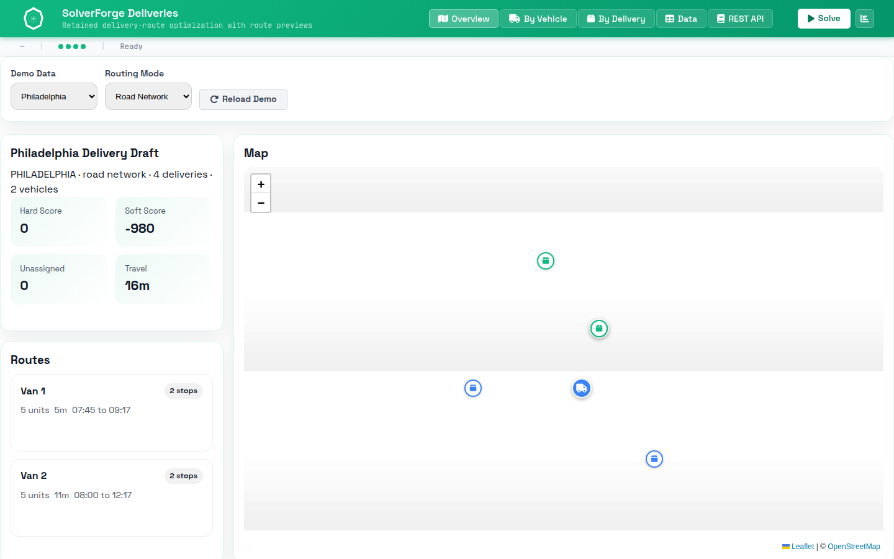

# SolverForge Deliveries



`solverforge-deliveries` is a SolverForge vehicle-routing app with retained
jobs, route geometry, insertion recommendations, and a browser plan viewer.

It answers one concrete question:

"Given depots, vehicles, delivery stops, capacities, and time windows, which
vehicle should visit each delivery and in what order?"

## Quick Start

```sh
make run-release
```

Then open `http://localhost:7860`.

To inspect the supported command surface:

```sh
make help
```

## Documentation Map

- `README.md`
  Quick start, model concepts, validation, REST API, and solver policy.
- `WIREFRAME.md`
  As-built architecture and runtime/data flow across backend, maps, and UI.
- `AGENTS.md`
  Codex-facing maintenance, validation, and documentation rules.
- `Makefile`
  Supported local commands for development, validation, Docker, and Space work.
- `Dockerfile`
  Docker Space image build using Rust 1.95 and the declared crates.io line.

## Current Dependency Shape

- Package: `solverforge-deliveries`; version is declared in `Cargo.toml`
- Release binary: `solverforge_deliveries`
- Rust: `1.95`
- SolverForge runtime: `solverforge` `0.19.0`
- Browser UI assets: `solverforge-ui` `0.6.5`
- Routing engine: `solverforge-maps` `2.1.4`
- Scaffold metadata: `solverforge-cli` `2.2.2` in `solverforge.app.toml`

The app serves registry-backed Rust dependencies, local static browser modules,
and Axum API routes from one process.

## Model Concepts

- `Delivery` is a problem fact: input data the solver reads but does not move.
- `Vehicle` is a planning entity: each vehicle owns one mutable route.
- `Vehicle.delivery_order` is the list planning variable: the sequence
  SolverForge changes during construction and local search.
- `Plan` is the planning solution: it owns deliveries, vehicles, road-network
  routing state, view state, and the current `HardSoftScore`.

The app ships three deterministic datasets: `PHILADELPHIA` with 82 deliveries,
`HARTFORD` with 50 deliveries, and `FIRENZE` with 80 deliveries. Each dataset
has ten vehicles and coherent capacity for the published stops.

## Constraints

Hard constraints:

- Every delivery is assigned.
- Vehicle capacity is not exceeded.
- Vehicle routes respect delivery time windows.

Soft constraints:

- Total travel time is minimized.

## REST API

- `GET /health`
- `GET /info`
- `GET /demo-data`
- `GET /demo-data/{id}`
- `POST /jobs`
- `GET /jobs/{id}`
- `DELETE /jobs/{id}`
- `GET /jobs/{id}/status`
- `GET /jobs/{id}/snapshot`
- `GET /jobs/{id}/analysis`
- `GET /jobs/{id}/routes`
- `POST /jobs/{id}/pause`
- `POST /jobs/{id}/resume`
- `POST /jobs/{id}/cancel`
- `GET /jobs/{id}/events`
- `POST /recommendations/delivery-insertions`

`snapshot_revision={n}` is optional for snapshots, analysis, and routes. SSE
clients receive a bootstrap event and then live retained-job events.

## Solver Policy

`solver.toml` is embedded by `Plan` and is the runtime source of truth.

- `list_clarke_wright` builds initial delivery routes.
- `list_k_opt` improves those routes before local search.
- `Vehicle.delivery_order` declares `domain = "cvrp"`, so SolverForge wires
  stock CVRP construction and route-local behavior over per-vehicle prepared
  matrices.
- Local search combines nearby list change/swap, reverse, k-opt, ruin, and
  limited sublist moves over `Vehicle.delivery_order`.
- `late_acceptance` with `first_last_step_score_improving` keeps scanning past
  equal accepted moves until the current step score improves.
- Solving stops after 30 seconds total or after 5 seconds without improvement.

The app uses `solverforge-maps` to load a road graph and return route geometry
through `/jobs/{id}/routes`.

## Validation

Standard validation:

```sh
make test
```

Full local validation:

```sh
make ci-local
```

Live road-network smoke:

```sh
make test-live-road
```

`make test` runs Rust tests, browserless frontend tests, and Playwright browser
tests. `make ci-local` adds formatting, clippy, release build, and Docker image
build. `make pre-release` runs `ci-local` plus the live road-network smoke.

## Hugging Face Space Deployment

This repo is Docker-Space ready. The Space reads the README front matter,
builds `Dockerfile`, and expects the app to bind `PORT=7860`.

Local Space-equivalent commands:

```sh
make space-build
make space-run
```

## Read The Code In This Order

1. `src/domain/mod.rs`
   The `planning_model!` manifest and public domain exports.
2. `src/domain/plan.rs`
   The `Plan` solution, CVRP list-variable profile, and road-network marker.
3. `src/domain/delivery.rs` and `src/domain/vehicle.rs`
   The problem fact and planning entity.
4. `src/domain/route_metrics/`
   Route preparation, CVRP matrix data, preview scoring, route geometry, and
   insertion ranking.
5. `src/constraints/mod.rs` and `src/constraints/*.rs`
   The score model, one rule per file.
6. `src/data/data_seed/entrypoints.rs`
   Public demo-data IDs and generator dispatch.
7. `src/data/data_seed/{philadelphia,hartford,firenze}/`
   City depots and delivery coordinates.
8. `src/solver/service.rs`
   Retained-job orchestration over `SolverManager<Plan>`.
9. `src/api/routes.rs`, `src/api/dto.rs`, and `src/api/sse.rs`
   HTTP routes, transport DTOs, and live-event streaming.
10. `static/app/main.mjs`, `static/app/models/`, and `static/app/ui/`
    Browser controller, model normalization, maps, tables, and modals.

## Project Shape

- `src/domain/`
  Planning model, domain types, route metrics, and model tests.
- `src/constraints/`
  Incremental SolverForge scoring rules.
- `src/data/`
  Deterministic city demo-data generators.
- `src/solver/`
  Retained-job facade and runtime event payload formatting.
- `src/api/`
  Axum routes, DTOs, errors, and SSE endpoint.
- `static/app/`
  Browser modules built on stock `solverforge-ui` assets.
- `tests/api_contract/`
  API integration coverage for catalog, jobs, lifecycle, SSE, and routes.
- `tests/e2e/`
  Playwright browser tests for the served app.
