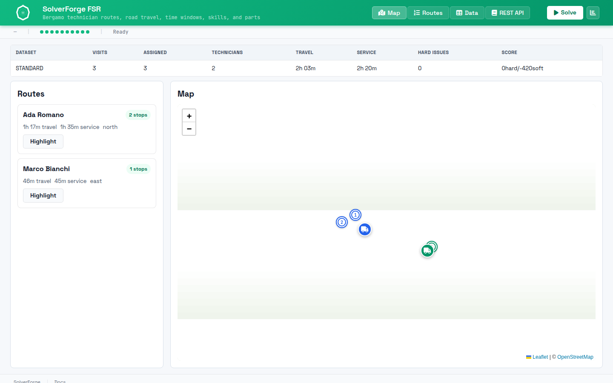

# SolverForge FSR



`solverforge-fsr` is a SolverForge field-service routing app with retained
jobs, technician schedules, road-network geometry, and a browser map workspace.

It answers one concrete question:

"Given technicians, service visits, skills, parts, shifts, territories, and
road-network travel, which technician should serve each visit and in what
order?"

## Quick Start

```sh
make run-release
```

Then open `http://localhost:7860`.

To inspect the supported command surface:

```sh
make help
```

## Documentation Map

- `README.md`
  Quick start, model concepts, validation, REST API, and solver policy.
- `WIREFRAME.md`
  As-built architecture and runtime/data flow across backend, routing, and UI.
- `AGENTS.md`
  Codex-facing maintenance, validation, and documentation rules.
- `Makefile`
  Supported local commands for development, validation, Docker, and Space work.
- `Dockerfile`
  Docker Space image build using Rust 1.95 and the declared crates.io line.

## Current Dependency Shape

- Package: `solverforge-fsr`; version is declared in `Cargo.toml`
- Release binary: `solverforge_fsr`
- Rust: `1.95`
- SolverForge runtime: `solverforge` `0.17.1`
- SolverForge core helpers: `solverforge-core` `0.17.1`
- Browser UI assets: `solverforge-ui` `0.6.5`
- Routing engine: `solverforge-maps` `2.1.4`
- Scaffold metadata: `solverforge-cli` `2.2.2` in `solverforge.app.toml`

The app serves registry-backed Rust dependencies, local static browser modules,
and Axum API routes from one process.

## Model Concepts

- `Location` is a problem fact: a depot or customer coordinate.
- `ServiceVisit` is a problem fact: a customer job the solver must place in a
  route.
- `TravelLeg` is a problem fact: precomputed duration, distance, and
  reachability between two locations.
- `TechnicianRoute` is the planning entity: one route owned by one technician.
- `TechnicianRoute.visits` is the list planning variable: the ordered visit
  sequence SolverForge changes.
- `FieldServicePlan` is the planning solution with the current `HardSoftScore`.

The app ships one deterministic `STANDARD` Bergamo dataset with two depots, six
technicians, 24 customer locations, and 48 service visits.

## Constraints

Hard constraints:

- Every service visit is assigned exactly once, and route visit indexes are valid.
- Every route leg is reachable.
- The assigned technician has the required skills.
- The assigned technician carries the required parts.
- Visits fit their time windows.
- Routes fit technician shift capacity.

Soft constraints:

- Total travel time is minimized.
- Workload is balanced across technicians.
- Territory affinity is preferred.
- Higher-priority visits have less slack.

## REST API

- `GET /health`
- `GET /info`
- `GET /demo-data`
- `GET /demo-data/{id}`
- `POST /jobs`
- `GET /jobs/{id}`
- `DELETE /jobs/{id}`
- `GET /jobs/{id}/status`
- `GET /jobs/{id}/snapshot`
- `GET /jobs/{id}/analysis`
- `GET /jobs/{id}/routes`
- `POST /jobs/{id}/pause`
- `POST /jobs/{id}/resume`
- `POST /jobs/{id}/cancel`
- `GET /jobs/{id}/events`

`snapshot_revision={n}` is optional for snapshots, analysis, and route
geometry. Route geometry reports unreachable, snap-failed, and no-path legs as
segment statuses so one failed road leg does not hide the rest of the route.

## Solver Policy

`solver.toml` is embedded by `FieldServicePlan` and is the runtime source of
truth.

- `list_round_robin` creates the first visit distribution.
- Local search combines list change, list swap, sublist change, sublist swap,
  and reverse moves over `TechnicianRoute.visits`.
- `hill_climbing` with `first_best_score_improving` keeps this tutorial easy to
  reason about.
- Solving stops after 60 seconds.

Road-network routing is prepared from the deterministic Bergamo coordinates and
stored as `TravelLeg` facts before solving.

## Validation

Standard validation:

```sh
make test
```

Full local validation:

```sh
make ci-local
```

`make test` runs Rust tests, JavaScript syntax checks, and Playwright browser
tests. `make ci-local` adds formatting, clippy, release build, and Docker image
build.

## Hugging Face Space Deployment

This repo is Docker-Space ready. The Space reads the README front matter,
builds `Dockerfile`, and expects the app to bind `PORT=7860`.

Local Space-equivalent commands:

```sh
make space-build
make space-run
```

## Read The Code In This Order

1. `src/domain/mod.rs`
   The `planning_model!` manifest and public domain exports.
2. `src/domain/field_service_plan.rs`
   The solution type, fact collections, route entities, transient index
   normalization, route shadow refresh, and score.
3. `src/domain/location.rs`, `src/domain/service_visit.rs`, and
   `src/domain/travel_leg.rs`
   The problem facts the solver reads.
4. `src/domain/technician_route.rs` and `src/domain/route_metrics.rs`
   The planning entity, list variable SolverForge mutates, and route shadow
   measurements used by stock constraints.
5. `src/data/data_seed.rs`
   Demo ID, Bergamo data assembly, routing preparation, and cache policy.
6. `src/constraints/mod.rs`
   The score model assembled from SolverForge constraints.
7. `src/constraints/*.rs`
   One business scoring rule per file. Most rules use stock `ConstraintFactory`
   streams; duplicate visit assignment uses a custom incremental counter so
   retained score analysis counts only real duplicate groups.
8. `src/solver/service.rs`
   Retained-job orchestration over `SolverManager<FieldServicePlan>`.
9. `src/api/routes.rs`, `src/api/dto.rs`, `src/api/route_geometry.rs`, and
   `src/api/sse.rs`
   HTTP routes, transport DTOs, route geometry, and live-event streaming.
10. `static/app.js` and `static/app-*.js`
    Browser lifecycle, dataset loading, route rendering, maps, tables, and API
    guide.

## Project Shape

- `src/domain/`
  Planning model, domain types, route entities, and route shadow measurements.
- `src/constraints/`
  SolverForge scoring rules, one business rule per file; most use stock streams.
- `src/data/`
  Deterministic Bergamo demo data and road-network preparation.
- `src/solver/`
  Retained-job facade and runtime event payload formatting.
- `src/api/`
  Axum routes, DTOs, route geometry, and SSE endpoint.
- `static/`
  Browser workspace built on stock `solverforge-ui` assets.
- `tests/e2e/`
  Playwright browser tests for the served app.
