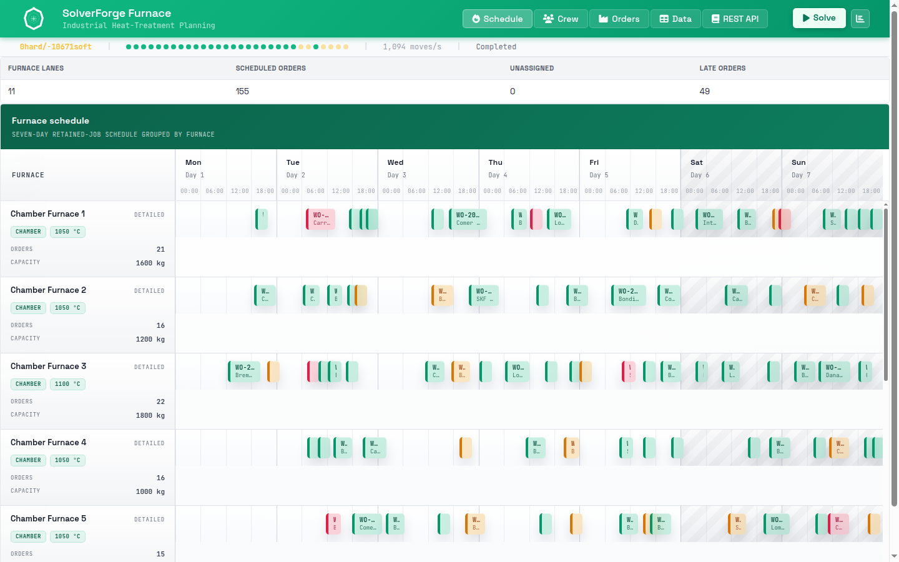

# SolverForge Furnace



`solverforge-furnace` is a SolverForge heat-treatment scheduling app with
retained jobs, a furnace schedule timeline, operator roster views, and a
browser workspace built on the shared `solverforge-ui` shell.

It answers one concrete question:

"Given furnaces, work orders, task operators, and a weekly shift roster, when
should each order run, on which furnace, and which operator performs each
manual task?"

## Quick Start

```sh
make run-release
```

Then open `http://localhost:7860`.

To inspect the supported command surface:

```sh
make help
```

## Documentation Map

- `README.md`
  Quick start, model concepts, validation, REST API, and solver policy.
- `WIREFRAME.md`
  As-built architecture and runtime/data flow across backend, runtime, and UI.
- `AGENTS.md`
  Codex-facing maintenance, validation, and documentation rules.
- `Makefile`
  Supported local commands for development, validation, Docker, and Space work.
- `Dockerfile`
  Docker Space image build using Rust 1.95 and the declared crates.io line.

## Current Dependency Shape

- Package: `solverforge-furnace`; version is declared in `Cargo.toml`
- Release binary: `solverforge-furnace`
- Rust: `1.95`
- SolverForge runtime: `solverforge` `0.19.4`
- Browser UI assets: `solverforge-ui` `0.6.5`
- Scaffold metadata: `solverforge-cli` `2.2.2` in `solverforge.app.toml`

The app serves registry-backed Rust dependencies, local static browser modules,
and Axum API routes from one process.

## Model Concepts

- `Furnace`, `WorkOrder`, `Operator`, `Shift`, and `ShiftCoverageDemand` are
  problem facts: input data the solver reads but does not move.
- `FurnaceAssignment` is a planning entity: one batch decision per work order.
  Its `assignment` variable combines the target furnace and 15-minute start slot
  into a single scalar value, and its four task variables pick the operator for
  load/build, program, quench, and unload.
- `OperatorShiftAssignment` is a planning entity: one row per operator and
  roster day. Its `shift_type` variable chooses Morning, Afternoon, Night, or
  Off.
- `Plan` is the planning solution with the current `HardSoftScore`.

Time is measured in minutes since Monday 00:00 over a seven-day horizon with a
15-minute time step. A batch always moves through a heating ramp followed by a
soak. Around each batch the app books four manual tasks relative to the batch
start and end: load/build, program, quench when the process requires it, and
unload.

The app ships one deterministic `STANDARD` dataset with 11 furnaces, 155 work
orders, 39 operators, 22 shifts, and 44 coverage demands. It starts with every
order and operator unassigned, so the timeline is empty until the solver runs.

## Constraints

Hard constraints:

- Every work order must be scheduled.
- A furnace must support the order process, temperature, and load.
- A batch must finish inside the seven-day horizon.
- Batches on the same furnace cannot overlap and must respect the thermal
  changeover gap.
- Each manual task window must be owned by a single shift.
- Assigned tasks require a scheduled batch.
- Every required manual task must receive an operator.
- The operator must have the task's skill and be rostered on the owning shift.
- An operator cannot be double-booked across overlapping task windows.
- Each `(shift, role)` coverage demand must be staffed.
- Monitoring capacity must cover ramp, soak, and task load in every 15-minute
  bucket.
- Day-only operators cannot work nights.
- Consecutive days must respect minimum rest.
- Operators cannot exceed the weekly visible-shift and consecutive-night limits.

Soft constraints:

- Express, Urgent, and Standard orders are penalized by lateness with
  priority-weighted cost.
- Thermal changeover cost is minimized.
- Early finishing above the due time is mildly penalized.
- Night starts for non-carburizing/non-nitriding work are discouraged.
- Overtime above the target weekly shift count is penalized.
- Working shifts are balanced across operators.

## REST API

- `GET /health`
- `GET /info`
- `GET /demo-data`
- `GET /demo-data/{id}`
- `POST /jobs`
- `GET /jobs/{id}`
- `DELETE /jobs/{id}`
- `GET /jobs/{id}/status`
- `GET /jobs/{id}/snapshot`
- `GET /jobs/{id}/analysis`
- `GET /jobs/{id}/analysis/{constraint_name}`
- `POST /jobs/{id}/pause`
- `POST /jobs/{id}/resume`
- `POST /jobs/{id}/cancel`
- `GET /jobs/{id}/events`

`snapshot_revision={n}` is optional for snapshots and analysis. SSE clients
receive a bootstrap event and then live retained-job events.

## Solver Policy

`solver.toml` is embedded by `Plan` and is the runtime source of truth.

- `random_seed = 42` keeps the demo reproducible.
- Three grouped construction phases assign furnace slots
  (`weakest_fit_decreasing`), the operator roster (`cheapest_insertion`), and
  task operators (`weakest_fit`), each with
  `construction_obligation = "assign_when_candidate_exists"`.
- A variable-neighborhood-descent local search performs hard repair with
  compound conflict-repair and grouped-scalar selectors.
- A simulated-annealing polish phase uses `decay_rate = 0.999985`,
  `hard_regression_policy = "never_accept_hard_regression"`, and an
  `accepted_count` forager with `limit = 256`.
- Solving stops after 45 seconds, or after 12 seconds without improvement.

The slow acceptance test expects solving to reach hard feasibility from the
fully unassigned public instance while soft penalties continue to represent
schedule quality.

## Validation

Standard validation:

```sh
make test
```

Full local validation:

```sh
make ci-local
```

Slow acceptance solve:

```sh
make test-slow
```

`make test` runs Rust tests, frontend syntax checks, and a Playwright browser
smoke. `make ci-local` adds formatting, clippy, release build, and Docker image
build. `make pre-release` runs `ci-local` plus the slow acceptance solve.

## Hugging Face Space Deployment

This repo is Docker-Space ready. The Space reads the README front matter,
builds `Dockerfile`, and expects the app to bind `PORT=7860`.

Local Space-equivalent commands:

```sh
make space-build
make space-run
```

## Read The Code In This Order

1. `src/domain/mod.rs`
   The `planning_model!` manifest and public domain exports.
2. `src/domain/plan.rs`
   The `Plan` solution, fact collections, and entity collections.
3. `src/domain/resources.rs`
   `Furnace`, `WorkOrder`, `Operator`, `Shift`, and `ShiftCoverageDemand`.
4. `src/domain/furnace.rs` and `src/domain/coverage.rs`
   The two planning entities and their derived task/roster helpers.
5. `src/constraints/mod.rs` and `src/constraints/*.rs`
   The score model, one rule group per file.
6. `src/data/data_seed/`
   The deterministic `STANDARD` demo generator.
7. `src/solver/service.rs`
   Retained-job orchestration over `SolverManager<Plan>`.
8. `src/solver/scalar_groups.rs` and `src/solver/conflict_repair.rs`
   The grouped scalar providers and conflict-directed repair providers that
   `solver.toml` refers to by name.
9. `src/api/routes/` and `src/api/dto/`
   HTTP routes, transport DTOs, and live-event streaming.
10. `static/app/runtime.js` and `static/app/schedule.js`
    Browser boot sequence, solver controls, and furnace timeline rendering.

## Project Shape

- `src/domain/`
  Planning model, domain types, planning variables, and derived indexes.
- `src/constraints/`
  Incremental SolverForge scoring rules.
- `src/data/`
  Deterministic heat-treatment demo-data generator.
- `src/solver/`
  Retained-job facade, scalar-group providers, conflict-repair providers, and
  runtime event payload formatting.
- `src/api/`
  Axum routes, DTOs, and SSE endpoint.
- `static/`
  Browser workspace built on stock `solverforge-ui` assets.
- `Makefile`
  Contains the inline `test-e2e` Playwright smoke for the served app.
