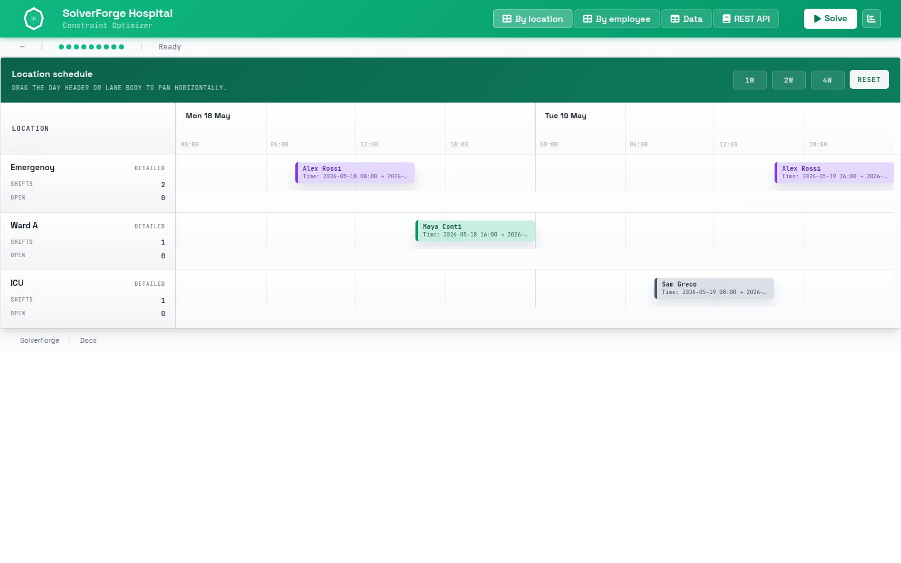

# SolverForge Hospital



`solverforge-hospital` is a SolverForge employee-scheduling app with retained
jobs, schedule analysis, and a browser timeline workspace.

It answers one concrete question:

"Given a hospital workforce and a month of shifts, which employee should cover
each shift?"

## Quick Start

```sh
make run-release
```

Then open `http://localhost:7860`.

To inspect the supported command surface:

```sh
make help
```

## Documentation Map

- `README.md`
  Quick start, model concepts, validation, REST API, and solver policy.
- `WIREFRAME.md`
  As-built architecture and runtime/data flow across backend, runtime, and UI.
- `docs/api-and-solver-policy.md`
  Detailed route, payload, lifecycle, telemetry, and solver-policy reference.
- `AGENTS.md`
  Codex-facing maintenance, validation, and documentation rules.
- `Makefile`
  Supported local commands for development, validation, Docker, and Space work.
- `Dockerfile`
  Docker Space image build using Rust 1.95 and the declared crates.io line.

## Current Dependency Shape

- Package: `solverforge-hospital`; version is declared in `Cargo.toml`
- Release binary: `solverforge-hospital`
- Rust: `1.95`
- SolverForge runtime: `solverforge` `0.19.3`
- Browser UI assets: `solverforge-ui` `0.6.5`
- Scaffold metadata: `solverforge-cli` `2.2.2` in `solverforge.app.toml`

The app serves registry-backed Rust dependencies, local static browser modules,
and Axum API routes from one process.

## Model Concepts

- `Employee` is a problem fact: input staff data the solver reads but does not
  move.
- `Shift` is the planning entity: each shift needs exactly one employee.
- `Shift.employee_idx` is the scalar planning variable: the employee index
  SolverForge changes during construction and local search.
- `CareHub` is a derived domain grouping that makes nearby search prefer
  employees close to the service line.
- `Plan` is the planning solution with the current `HardSoftDecimalScore`.

The app ships one deterministic `LARGE` dataset with a 28-day horizon, 50
employees, and 688 shifts.

## Constraints

Hard constraints:

- Every shift is assigned.
- The assigned employee has the required skill.
- An employee is not assigned to overlapping shifts.
- An employee has at least 10 hours between two shifts.
- An employee works at most one shift per day.
- Unavailable employees are not assigned.

Soft constraints:

- Undesired days are avoided.
- Desired days are rewarded.
- Assignments are balanced across employees.

## REST API

- `GET /health`
- `GET /info`
- `GET /demo-data`
- `GET /demo-data/{id}`
- `POST /jobs`
- `GET /jobs/{id}`
- `DELETE /jobs/{id}`
- `GET /jobs/{id}/status`
- `GET /jobs/{id}/snapshot`
- `GET /jobs/{id}/analysis`
- `POST /jobs/{id}/pause`
- `POST /jobs/{id}/resume`
- `POST /jobs/{id}/cancel`
- `GET /jobs/{id}/events`

`snapshot_revision={n}` is optional for snapshots and analysis. SSE clients
receive a bootstrap event and then live retained-job events. The browser also
exposes a visible REST API guide expected to match
`docs/api-and-solver-policy.md`.

## Solver Policy

`solver.toml` is embedded by `Plan` and is the runtime source of truth.

- `cheapest_insertion` assigns employee indexes during construction.
- Local search uses nearby change and nearby swap moves over
  `Shift.employee_idx`.
- Nearby search reads the app's care-hub distance signals so moves stay focused
  on plausible employee/shift pairs.
- `late_acceptance` with an accepted-count forager keeps several candidate
  moves alive per step.
- Solving stops after 30 seconds total or after 5 seconds without improvement.

The hidden witness roster in `src/data/data_seed/witness.rs` shapes a
hard-feasible public instance, but the solver never receives the witness itself.

## Validation

Standard validation:

```sh
make test
```

Full local validation:

```sh
make ci-local
```

Slow acceptance solve:

```sh
make test-slow
```

`make test` runs Rust tests, browserless frontend tests, and Playwright browser
tests. `make ci-local` adds formatting, clippy, release build, and Docker image
build. `make pre-release` runs `ci-local` plus the slow acceptance solve.

## Hugging Face Space Deployment

This repo is Docker-Space ready. The Space reads the README front matter,
builds `Dockerfile`, and expects the app to bind `PORT=7860`.

Local Space-equivalent commands:

```sh
make space-build
make space-run
```

## Read The Code In This Order

1. `src/domain/employee.rs`
   The staff problem fact model.
2. `src/domain/care_hub.rs`
   Service-line grouping for nearby search.
3. `src/domain/mod.rs`
   The `planning_model!` manifest and public domain exports.
4. `src/domain/plan.rs`
   The `Shift` planning entity, `Plan` solution, derived fields, and nearby
   meters.
5. `src/constraints/mod.rs` and `src/constraints/*.rs`
   The score model, one scheduling rule per file.
6. `src/data/data_seed/entrypoints.rs`
   Public demo-data IDs.
7. `src/data/data_seed/large.rs` and `src/data/data_seed/witness.rs`
   The published instance builder and hidden feasibility witness.
8. `src/solver/service.rs`
   Retained-job orchestration over `SolverManager<Plan>`.
9. `src/api/routes.rs`, `src/api/dto.rs`, and `src/api/sse.rs`
   HTTP routes, transport DTOs, and live-event streaming.
10. `static/app/main.mjs`, `static/app/shell/`, and `static/app/schedule/`
    Browser boot sequence, shell, and timeline views.

## Project Shape

- `src/domain/`
  Planning model, domain types, derived fields, and nearby meters.
- `src/constraints/`
  Incremental SolverForge scoring rules.
- `src/data/`
  Deterministic hospital demo-data generator.
- `src/solver/`
  Retained-job facade and runtime event payload formatting.
- `src/api/`
  Axum routes, DTOs, and SSE endpoint.
- `static/app/`
  Browser modules built on stock `solverforge-ui` assets.
- `tests/frontend/`
  Browserless UI tests using the fake DOM in `tests/support/`.
- `tests/e2e/`
  Playwright browser tests for the served app.
