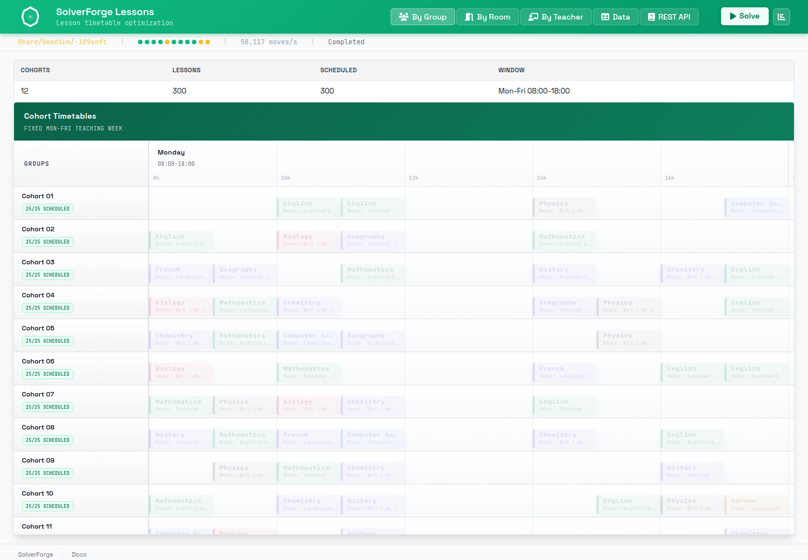

# SolverForge Lessons



`solverforge-lessons` is a SolverForge lesson-timetabling app with retained
jobs, cohort timetable views, and a browser schedule workspace.

It answers one concrete question:

"Given lessons, teachers, student groups, rooms, and weekly timeslots, which
timeslot and room should each lesson receive?"

## Acknowledgement

Thanks to `@benabel` (Prof. Benjamin Abel), whose referral is also credited in
the core SolverForge README.

## Quick Start

```sh
make run-release
```

Then open `http://localhost:7860`.

To inspect the supported command surface:

```sh
make help
```

## Documentation Map

- `README.md`
  Quick start, model concepts, validation, REST API, and solver policy.
- `WIREFRAME.md`
  As-built architecture and runtime/data flow across backend, runtime, and UI.
- `AGENTS.md`
  Codex-facing maintenance, validation, and documentation rules.
- `Makefile`
  Supported local commands for development, validation, Docker, and Space work.
- `Dockerfile`
  Docker Space image build using Rust 1.95 and the declared crates.io line.

## Current Dependency Shape

- Package: `solverforge-lessons`; version is declared in `Cargo.toml`
- Release binary: `solverforge-lessons`
- Rust: `1.95`
- SolverForge runtime: `solverforge` `0.15.0`
- Browser UI assets: `solverforge-ui` `0.6.5`
- Scaffold metadata: `solverforge-cli` `2.0.4` in `solverforge.app.toml`

The app serves registry-backed Rust dependencies, local static browser modules,
and Axum API routes from one process.

## Model Concepts

- `Timeslot`, `Teacher`, `Group`, and `Room` are problem facts: input data the
  solver reads but does not move.
- `Lesson` is the planning entity: each subject meeting needs a timeslot and a
  room.
- `Lesson.timeslot_idx` is a scalar planning variable: the timeslot index
  SolverForge changes.
- `Lesson.room_idx` is a scalar planning variable: the room index SolverForge
  changes.
- `Plan` is the planning solution with the current `HardMediumSoftScore`.

The app ships one deterministic `LARGE` dataset with 300 lessons, 12 student
groups, 40 weekly timeslots, and 10 typed rooms. It starts with every lesson
unassigned, so the initial score is `0hard/-600medium/0soft`.

## Constraints

Hard constraints:

- Teachers can teach only in available timeslots.
- Student groups can attend only in available timeslots.
- A room must be large enough for the assigned group.
- A teacher cannot teach overlapping lessons.
- A group cannot attend overlapping lessons.
- A room cannot host overlapping lessons.

Medium constraints:

- Every lesson should receive a timeslot.
- Every lesson should receive a room.

Soft constraints:

- Room kind should match the subject.
- Lessons should avoid late-day slots when possible.
- The same subject should not repeat twice in one day for a cohort.

## REST API

- `GET /health`
- `GET /info`
- `GET /demo-data`
- `GET /demo-data/{id}`
- `POST /jobs`
- `GET /jobs/{id}`
- `DELETE /jobs/{id}`
- `GET /jobs/{id}/status`
- `GET /jobs/{id}/snapshot`
- `GET /jobs/{id}/analysis`
- `POST /jobs/{id}/pause`
- `POST /jobs/{id}/resume`
- `POST /jobs/{id}/cancel`
- `GET /jobs/{id}/events`

`snapshot_revision={n}` is optional for snapshots and analysis. SSE clients
receive a bootstrap event and then live retained-job events.

## Solver Policy

`solver.toml` is embedded by `Plan` and is the runtime source of truth.

- `cheapest_insertion` assigns timeslots and rooms during construction.
- `construction_obligation = "assign_when_candidate_exists"` makes
  construction fill variables when a legal candidate exists.
- `value_candidate_limit = 40` bounds construction candidate scanning.
- Local search uses `late_acceptance` with an accepted-count forager.
- Solving stops after 30 seconds.

The slow acceptance test expects solving to reach hard and medium feasibility
from the fully unassigned public instance while soft penalties continue to
represent timetable quality.

## Validation

Standard validation:

```sh
make test
```

Full local validation:

```sh
make ci-local
```

Slow acceptance solve:

```sh
make test-slow
```

`make test` runs Rust tests, frontend syntax checks, and a Playwright browser
smoke. `make ci-local` adds formatting, clippy, release build, and Docker image
build. `make pre-release` runs `ci-local` plus the slow acceptance solve.

## Hugging Face Space Deployment

This repo is Docker-Space ready. The Space reads the README front matter,
builds `Dockerfile`, and expects the app to bind `PORT=7860`.

Local Space-equivalent commands:

```sh
make space-build
make space-run
```

## Read The Code In This Order

1. `src/domain/mod.rs`
   The `planning_model!` manifest and public domain exports.
2. `src/domain/plan.rs`
   The `Plan` solution, fact collections, lesson entities, and normalized
   index fields.
3. `src/domain/lesson.rs`
   The planning entity and the two scalar planning variables.
4. `src/domain/{timeslot,teacher,group,room}.rs`
   The problem facts the constraints join against.
5. `src/constraints/mod.rs` and `src/constraints/*.rs`
   The score model, one timetable rule per file.
6. `src/data/data_seed/entrypoints.rs`
   Public demo-data IDs and generator dispatch.
7. `src/data/data_seed/large.rs`
   The published instance builder.
8. `src/solver/service.rs`
   Retained-job orchestration over `SolverManager<Plan>`.
9. `src/api/routes.rs`, `src/api/dto.rs`, and `src/api/sse.rs`
   HTTP routes, transport DTOs, and live-event streaming.
10. `static/app.js` and `static/views.js`
    Browser boot sequence, solver controls, and timetable rendering.

## Project Shape

- `src/domain/`
  Planning model, domain types, planning variables, and derived indexes.
- `src/constraints/`
  Incremental SolverForge scoring rules.
- `src/data/`
  Deterministic lesson timetable demo-data generator.
- `src/solver/`
  Retained-job facade and runtime event payload formatting.
- `src/api/`
  Axum routes, DTOs, and SSE endpoint.
- `static/`
  Browser workspace built on stock `solverforge-ui` assets.
- `Makefile`
  Contains the inline `test-e2e` Playwright smoke for the served app.
